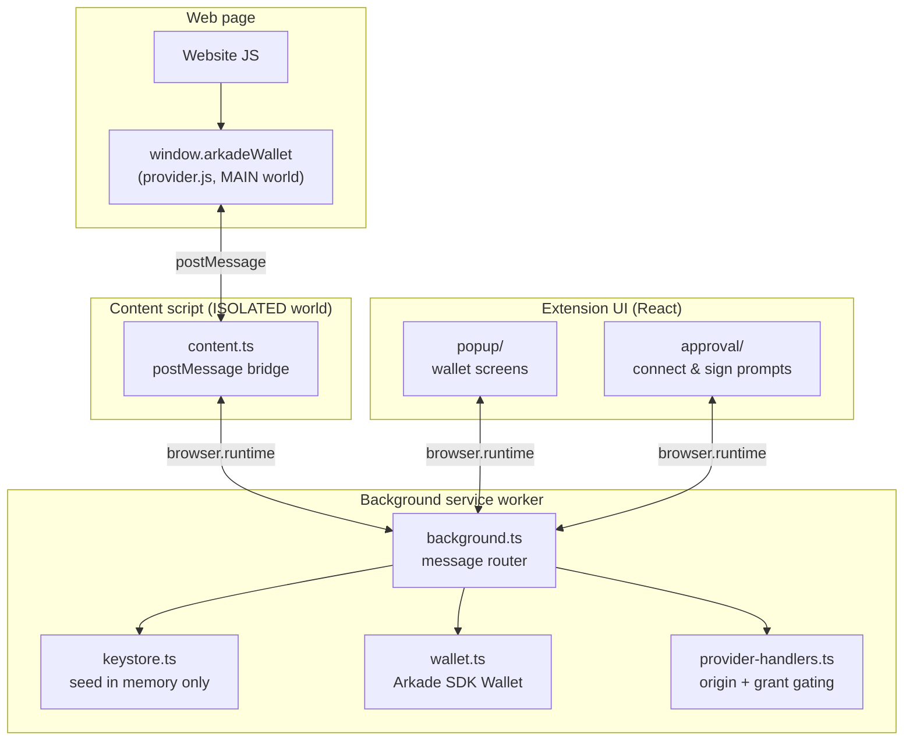

# Arkade Wallet — Architecture

A Tapscript-focused Bitcoin L2 wallet delivered as a Manifest V3 browser extension for the
[Arkade](https://arkadeos.com) protocol. It runs the `@arkade-os/sdk` `Wallet` inside the
background service worker, persists wallet state to IndexedDB so it survives the ~30s SW
idle-kill, and injects a `window.arkadeWallet` provider into web pages so web apps can connect,
read balances, and request signing approvals.

Built with [WXT](https://wxt.dev) + React.

## Overview

The extension follows a **hub-and-spoke** model: the **background service worker** is the only
component that holds secrets, talks to the Arkade operator, and signs transactions. Everything
else — the popup UI, the page provider, the approval window — is a client that asks the service
worker for things.



**Mental model:** a locked safe (background SW) with a small window (popup) and a doorbell
for websites (provider + content bridge). Everyone asks the safe; only the safe holds the key.

## Entrypoints (`entrypoints/`)

WXT scans this folder and maps each file to a manifest entry based on its name and exported
helper (`defineBackground`, `defineContentScript`, etc.).

| Entrypoint | File | Role |
|------------|------|------|
| Background | `background.ts` | Central message router. Keystore, wallet reads/writes, provider handlers, approval resolution. |
| Content script | `content.ts` | ISOLATED-world bridge. Injects the provider, forwards web app calls to the SW, relays provider events back to the page. |
| Provider | `provider.ts` | MAIN-world script injected into every page. Exposes `window.arkadeWallet`. Thin pass-through — no keys, no seed. |
| Popup | `popup/` | React UI opened when the user clicks the extension icon. Onboarding, wallet home, send, settings. |
| Approval | `approval/` | Dedicated popup window for connect/sign prompts. Cannot be iframed by a web app (CSP `frame-ancestors 'none'`). |

### Background (`entrypoints/background.ts`)

Stateless request router. Holds no live `Wallet` object between wakes — it rebuilds one from
the in-memory seed + IndexedDB on each request. The only persistent in-memory secret is the
unlocked seed in `keystore.ts`, zeroed on lock or auto-lock.

Responsibilities:

- **Keystore** — create, import, unlock, lock, backup reveal, network switch
- **Reads** — network (from `storage.ts`); address + balance are cache-first via `wallet-cache.ts` (instant `getWalletSnapshot`, then a live `refreshWalletSnapshot`) and readable while locked; transaction history is an on-demand, unlock-gated SDK fetch (rebuilt per call, not cached)
- **Writes** — off-chain send, on-chain offboard, VTXO renewal/recovery/onboarding
- **Provider** — origin-derived, grant-gated handlers for web app connect/read/sign
- **Approvals** — opens approval windows, resolves user decisions back to waiting web app promises

### Content script (`entrypoints/content.ts`)

Runs on `<all_urls>` at `document_start`. Three jobs:

1. Inject `provider.js` so `window.arkadeWallet` exists before the page's own scripts run.
2. Forward provider `postMessage` requests to the background over a **fixed allow-list** of
   methods. The background derives the caller's origin from the message sender — the page
   cannot spoof it.
3. Relay background-pushed provider events (`disconnect`, `networkChanged`, `accountsChanged`)
   into the page so the provider's `on()` handlers fire.

### Provider (`entrypoints/provider.ts`)

Runs in the page's **MAIN world** (same JS context as the website). An ISOLATED content script
cannot set page-visible globals, so the provider must be injected separately.

It talks to the content script via `window.postMessage` and exposes the provider API:

- **Connection** — `connect`, `disconnect`, `isConnected`, `getAccounts`
- **Reads** — `getAddress`, `getBoardingAddress`, `getPublicKey`, `getBalance`, `getNetwork`
- **Signing** — `signMessage`, `signPsbt` (each opens its own approval window)
- **Events** — `on` / `removeListener` for `accountsChanged`, `networkChanged`, `disconnect`

### Popup (`entrypoints/popup/`)

React app with a simple route union (no router library). On mount it asks the SW for lock state
and routes to welcome → create/import → unlock → home.

- `App.tsx` — route switcher
- `client.ts` — typed `sendMessage` wrapper (the popup never holds secrets)
- `screens/` — Welcome, CreatePassword, Backup, Import, Unlock, WalletHome, Send, Receive, History, Settings

### Approval (`entrypoints/approval/`)

A separate extension page opened in its own browser window (not the toolbar popup). Used when a
web app calls `connect`, `signMessage`, or `signPsbt`. The origin shown is SW-derived from the
pending request — never a site-supplied label. A short settle delay prevents blind click-through
approvals.

## Shared modules (`src/`)

| Module | Purpose |
|--------|---------|
| `messaging.ts` | Typed message protocol (`ProtocolMap`) between all clients and the background |
| `keystore.ts` | Encrypted vault + in-memory seed while unlocked; auto-lock alarms |
| `crypto.ts` | Mnemonic generation, vault encryption/decryption |
| `storage.ts` | `chrome.storage.local` (vault, network) and `session` (unlock flag only) |
| `wallet.ts` | Wraps `@arkade-os/sdk` — builds `Wallet`, reads/writes/transactions |
| `wallet-cache.ts` | Caches address + balance for instant popup render |
| `page-bridge.ts` | `postMessage` envelope shared by provider and content script |
| `provider-api.ts` | Provider types and error codes surfaced to web apps |
| `provider-handlers.ts` | Origin + grant checks, connect/sign flows, event emission |
| `provider-events.ts` | Background → content event relay format |
| `permissions.ts` | Per-origin connection grants |
| `approvals.ts` | Pending connect/sign request queue |
| `signing.ts` | Message and PSBT signing logic |
| `psbt-inspect.ts` | PSBT summary for the approval UI |
| `renewal.ts` | VTXO expiry warnings and renewal alarms |
| `vtxo-state.ts` | Expiry-adjusted balance buckets |
| `origin.ts` | Origin normalization helpers |

## Data storage

Three tiers, from most to least sensitive:

| Tier | Location | Contents |
|------|----------|----------|
| In-memory seed | `keystore.ts` (SW only) | Decrypted seed while unlocked. Cleared on lock or SW kill (~30s idle). |
| Encrypted vault | `chrome.storage.local` | Mnemonic encrypted with the user's password, bound to the active network (switching networks re-encrypts it, so the switch needs the password). |
| Public cache | `chrome.storage.local` | Address, balance snapshot, connected-site grants. No secrets. |
| SDK state | IndexedDB | VTXO/balance/history persisted by `@arkade-os/sdk`. Survives SW restarts. History reads call the SDK live rather than reading this store directly. |

The seed **never** goes to session storage, the popup, or web pages — except when the user
explicitly requests a backup phrase reveal.

## Message paths

### Popup opens

```
Popup → getLockState() → background → route to welcome / unlock / home
Home  → getWalletSnapshot() (instant cache) → refreshWalletSnapshot() (live operator)
```

### Web app calls the wallet

```
Website → window.arkadeWallet.connect()
       → provider.js (postMessage)
       → content.ts (allow-listed method)
       → background.ts (origin check → approval window)
       → user approves
       → background resolves promise
       → back through the chain
```

### User sends from popup

```
Send screen → client.send(address, amount)
           → background (requireWallet → validate → SDK sign)
           → txid back to popup
```

## Security boundaries

- **Seed isolation:** the decrypted seed lives only in SW module memory. It never crosses
  the `browser.runtime` boundary except the explicit `getMnemonicForBackup` reveal.
- **Origin authority:** provider handlers derive the caller origin from `sender`, never
  from a request body field the page could set.
- **Grant gating:** web apps must `connect` (and get user approval) before any read or sign call.
  Signing always re-prompts — it is not auto-granted by connect.
- **Trusted vs untrusted paths:** popup messages and approval-window messages are trusted
  extension pages. Provider messages are untrusted and always go through origin + grant checks.

## Build tooling

| Tool | Role |
|------|------|
| [WXT](https://wxt.dev) | MV3 extension build, entrypoint wiring, dev hot reload |
| React 19 | Popup and approval UI |
| Vitest | Unit tests in `src/*.test.ts` |
| `@arkade-os/sdk` | Wallet, signing, operator communication |
| `@webext-core/messaging` | Typed `sendMessage` / `onMessage` protocol |

Run `npm run dev` to start the dev server; WXT outputs a loadable extension from `.output/`.
