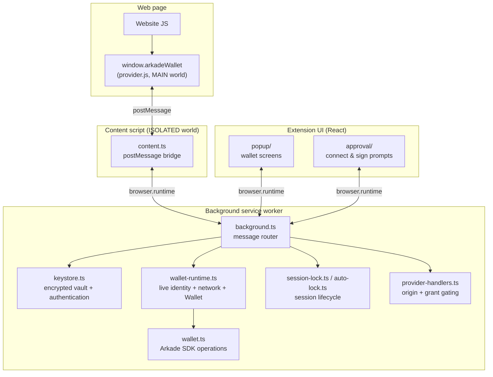

# Arkade Wallet — Architecture

A Tapscript-focused Bitcoin L2 wallet delivered as a Manifest V3 browser extension for the
[Arkade](https://arkadeos.com) protocol. It runs the `@arkade-os/sdk` `Wallet` inside the
background service worker, persists wallet state to IndexedDB so it survives the ~30s SW
idle-kill, and injects a `window.arkadeWallet` provider into web pages so web apps can connect,
read balances, and request signing approvals.

Built with [WXT](https://wxt.dev) + React.

## Overview

The extension follows a **hub-and-spoke** model: the **background service worker** is the only
component with a live signing identity, operator access, or transaction-signing capability.
Everything else — the popup UI, the page provider, the approval window — is a client that asks
the service worker for things. The popup handles a mnemonic only during explicit
create/import/backup screens; it never owns the live wallet session.



**Mental model:** a locked safe (background SW) with a small window (popup) and a doorbell
for websites (provider + content bridge). Everyone asks the safe; only the safe holds the key.

## Entrypoints (`entrypoints/`)

WXT scans this folder and maps each file to a manifest entry based on its name and exported
helper (`defineBackground`, `defineContentScript`, etc.).

| Entrypoint | File | Role |
|------------|------|------|
| Background | `background.ts` | Central message router. Keystore, wallet reads/writes, provider handlers, approval resolution. |
| Content script | `content.ts` | ISOLATED-world bridge. Injects the provider, forwards web app calls to the SW, relays provider events back to the page. |
| Provider | `provider.ts` | MAIN-world script injected into every page. Exposes `window.arkadeWallet`. Thin pass-through — no keys, no seed. |
| Popup | `popup/` | React UI opened when the user clicks the extension icon. Onboarding, wallet home, send, settings. |
| Approval | `approval/` | Dedicated popup window for connect/sign prompts. Cannot be iframed by a web app (CSP `frame-ancestors 'none'`). |

### Background (`entrypoints/background.ts`)

Thin request router. While the service worker is alive and unlocked, `wallet-runtime.ts` owns
one live signing identity, its network, and one lazily built SDK `Wallet`. Requests share that
wallet for the lifetime of the session. A service-worker restart loses the whole runtime
session and starts locked. Durable storage survives, but none of it restores session authority.

Responsibilities:

- **Vault** — create, import, password-authenticated unlock, and backup reveal through `keystore.ts`
- **Lifecycle** — manual/idle lock through `session-lock.ts`; alarm policy through `auto-lock.ts`; serialized, password-authenticated network changes through `network-switch.ts`
- **Reads** — configured network from `storage.ts`; address + balance are cache-first via `wallet-cache.ts` (instant `getWalletSnapshot`, then an unlock-gated live `refreshWalletSnapshot`); transaction history is an on-demand SDK fetch through the shared session wallet
- **Writes** — off-chain send, on-chain offboard, VTXO renewal/recovery/onboarding
- **Provider** — origin-derived, grant-gated handlers for web app connect/read/sign
- **Approvals** — opens approval windows, resolves user decisions back to waiting web app promises

### Content script (`entrypoints/content.ts`)

Runs on `<all_urls>` at `document_start`. Three jobs:

1. Inject `provider.js` so `window.arkadeWallet` exists before the page's own scripts run.
2. Forward provider `postMessage` requests to the background over a **fixed allow-list** of
   methods. The background derives the caller's origin from the message sender — the page
   cannot spoof it.
3. Relay background-pushed provider events (`disconnect`, `networkChanged`, `accountsChanged`)
   into the page so the provider's `on()` handlers fire.

### Provider (`entrypoints/provider.ts`)

Runs in the page's **MAIN world** (same JS context as the website). An ISOLATED content script
cannot set page-visible globals, so the provider must be injected separately.

It talks to the content script via `window.postMessage` and exposes the provider API:

- **Connection** — `connect`, `disconnect`, `isConnected`, `getAccounts`
- **Reads** — `getAddress`, `getBoardingAddress`, `getPublicKey`, `getBalance`, `getNetwork`
- **Signing** — `signMessage`, `signPsbt` (each opens its own approval window)
- **Events** — `on` / `removeListener` for `accountsChanged`, `networkChanged`, `disconnect`

### Popup (`entrypoints/popup/`)

React app with a simple route union (no router library). On mount it asks the SW for lock state
and routes to welcome → create/import → unlock → home.

- `App.tsx` — route switcher
- `client.ts` — typed `sendMessage` wrapper (the popup never holds a live signing capability)
- `screens/` — Welcome, CreatePassword, Backup, Import, Unlock, WalletHome, Send, Receive, History, Settings

### Approval (`entrypoints/approval/`)

A separate extension page opened in its own browser window (not the toolbar popup). Used when a
web app calls `connect`, `signMessage`, or `signPsbt`. The origin shown is SW-derived from the
pending request — never a site-supplied label. A short settle delay prevents blind click-through
approvals.

## Shared modules (`src/`)

| Module | Purpose |
|--------|---------|
| `messaging.ts` | Typed message protocol (`ProtocolMap`) between all clients and the background |
| `keystore.ts` | Encrypted mnemonic vault, password authentication, create/import, and backup reveal |
| `crypto.ts` | Mnemonic generation, vault encryption/decryption |
| `storage.ts` | Typed persistent storage for the encrypted vault and configured network |
| `wallet-runtime.ts` | Live identity, active session network, SDK wallet, epoch, and refresh state |
| `session-access.ts` | Popup/provider session access policy and user-activity auto-lock behavior |
| `session-lock.ts` | Shared manual/idle lock coordinator and capability revocation |
| `auto-lock.ts` | Browser alarm adapter; owns no wallet or vault state |
| `network-switch.ts` | Serialized, fail-closed vault/network/runtime transition coordinator |
| `wallet.ts` | Wraps `@arkade-os/sdk` wallet reads, writes, ramps, renewal, and recovery |
| `lightning.ts` | Session-bound Boltz/Lightning runtime with its own disposable manager lifecycle |
| `wallet-cache.ts` | Caches address + balance for instant popup render |
| `page-bridge.ts` | `postMessage` envelope shared by provider and content script |
| `provider-api.ts` | Provider types and error codes surfaced to web apps |
| `provider-handlers.ts` | Origin + grant checks, connect/sign flows, event emission |
| `provider-events.ts` | Background → content event relay format |
| `permissions.ts` | Per-origin connection grants |
| `approvals.ts` | Pending connect/sign request queue |
| `signing.ts` | Message and PSBT signing logic |
| `psbt-inspect.ts` | PSBT summary for the approval UI |
| `renewal.ts` | VTXO expiry warnings and renewal alarms |
| `vtxo-state.ts` | Expiry-adjusted balance buckets |
| `origin.ts` | Origin normalization helpers |

## Data storage

State is split by lifetime and sensitivity:

| Tier | Location | Contents |
|------|----------|----------|
| Live session | `wallet-runtime.ts` (SW only) | `SeedIdentity`, active network, session epoch, and lazy SDK `Wallet`. No longer obtainable from the runtime after lock; captured contexts are revoked. |
| Encrypted vault | `chrome.storage.local` | Mnemonic encrypted with the user's password, bound to the active network (switching networks re-encrypts it, so the switch needs the password). |
| Public cache | `chrome.storage.local` | Address, balance snapshot, connected-site grants. No secrets. |
| Ephemeral metadata | `chrome.storage.session` | The pending approval shown in the approval window. No secret or unlock hint. |
| SDK state | IndexedDB | VTXO/balance/history persisted by `@arkade-os/sdk`. Survives SW restarts. History reads call the SDK live rather than reading this store directly. |

`keystore.ts` never retains a plaintext mnemonic or an application-owned raw seed. It passes a
short-lived mnemonic to `wallet-runtime.ts`, which derives `SeedIdentity` and clears its
temporary raw-seed buffer after the SDK copies it. Mnemonics cross the popup/SW boundary only
for explicit create, import, and password-gated backup flows. No mnemonic, seed, identity, or
unlock flag is persisted in `chrome.storage.session`.

Locking is capability revocation, not guaranteed cryptographic erasure: the runtime drops its
active module-owned references and invalidates captured contexts synchronously. An already
running stack may still hold a stale reference, JavaScript cannot zero strings, and the SDK
controls its identity's internal key memory; this is why every mutation revalidates its context
immediately before entering the SDK.

## Message paths

### Popup opens

```
Popup → getLockState() → background → route to welcome / unlock / home
Home  → getWalletSnapshot() (instant cache) → refreshWalletSnapshot() (live operator)
```

### Web app calls the wallet

```
Website → window.arkadeWallet.connect()
       → provider.js (postMessage)
       → content.ts (allow-listed method)
       → background.ts (origin check → approval window)
       → user approves
       → background resolves promise
       → back through the chain
```

### User sends from popup

```
Send screen → client.send(address, amount)
           → background (acquire session context → validate → assert current → SDK sign)
           → txid back to popup
```

### Lock and network transitions

Manual and idle locks call the same `lockWallet` coordinator. It synchronously revokes the
runtime session before awaiting wallet/Lightning disposal, approval rejection, alarm cleanup,
or provider `disconnect` delivery. Create/import/unlock and popup operations that acquire a
session context rearm auto-lock. Provider requests and scheduled renewal do not, so a
connected site cannot keep the wallet unlocked indefinitely.

Network changes are serialized across authentication and commit. A wrong password is rejected
before teardown. Once prepared, the transition fences the old wallet and Lightning runtimes,
atomically persists the re-encrypted vault, target network, and snapshot invalidation, then
installs a target-network session only if the source session remained unlocked. Storage
failure leaves the runtime locked and the old durable vault/network pair authoritative.

## Security boundaries

- **Secret isolation:** encrypted key material is durable; plaintext mnemonic/seed values are
  short-lived, and the live SDK identity exists only inside the background runtime. Creation,
  import, and password-gated backup are the deliberate mnemonic boundary exceptions.
- **Session authority:** wallet, network, epoch, and signing identity come from one runtime
  context. Mutation paths assert that context immediately before entering an SDK capability.
- **Lock posture:** manual/idle lock invalidates session contexts before asynchronous cleanup;
  pending approvals are rejected and connected providers receive `disconnect`.
- **Origin authority:** provider handlers derive the caller origin from `sender`, never
  from a request body field the page could set.
- **Grant gating:** web apps must `connect` (and get user approval) before any read or sign call.
  Signing always re-prompts, and approval records are bound to the originating session epoch
  and network so they cannot resume after lock, unlock, or a network transition.
- **Trusted vs untrusted paths:** popup messages and approval-window messages are trusted
  extension pages. Provider messages are untrusted and always go through origin + grant checks.

## Build tooling

| Tool | Role |
|------|------|
| [WXT](https://wxt.dev) | MV3 extension build, entrypoint wiring, dev hot reload |
| React 19 | Popup and approval UI |
| Vitest | Unit tests in `src/*.test.ts` |
| `@arkade-os/sdk` | Wallet, signing, operator communication |
| `@webext-core/messaging` | Typed `sendMessage` / `onMessage` protocol |

Run `npm run dev` to start the dev server; WXT outputs a loadable extension from `.output/`.
